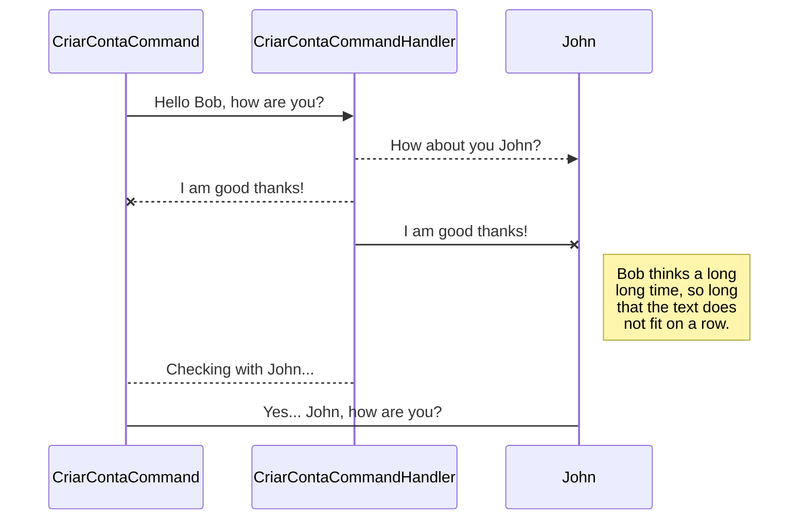

# bg-pubsub

Criacao de projeto teste PubSub
aliando a eventual necessidade de ter um producer e um consumer em um único Pod.

```sh
docker compose up
cd BG.PubSub.Api/
dotnet run
```

```http
localhost:15672
```
# user
guest
# password
guest

